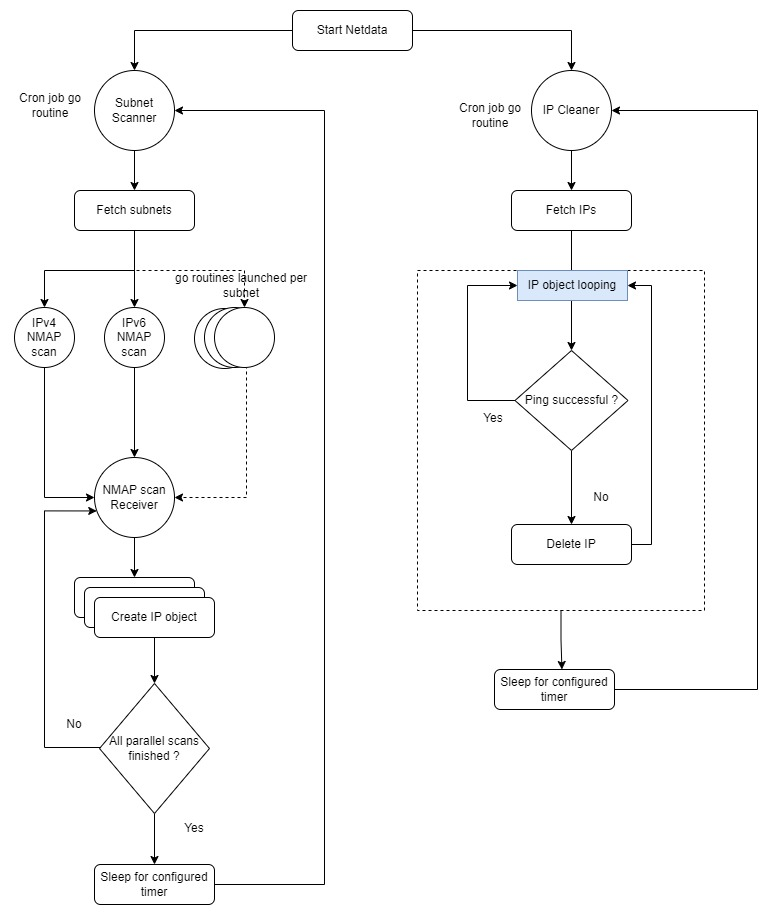

# netdata
[](http://makeapullrequest.com) 
[](LICENSE)

## Overview
The Netdata operator keeps a watch over subnets and scans or discovers the servers from the network by using two different ways NMAP and Netlink.

### NMAP
1. The Netdata operator scans for IPv4 addresses and creates the ip objects in the Kubernetes cluster.

### Netlink 
1. The Netdata operator reconciles on subnets. When the reconcile loop gets an update for a subnet, the process creates two go routines Netlink Processor and Netlink Listner.
2. For every event sent by Netlink, The Netlink Listener captures it and extracts the required data and sends it further to the Netlink Processor. The Netlink Processer then creates the IP object.
3. Every subnet will have a pair of go routine Netlink listener and Netlink processor to capture the IPv6 event.
4. When the subnet is deleted, the Netlink process also stops the go routines.
5. The Netada operator creates ip objects with two important labels ip address and the mac of the server. The IP and MAC info is further consumed by the oob-operator.

### IP object Cleanup process
1. A cron job is created for NMAP/Netlink process, this cron job runs for infinite time, in a single iteration all the IP objects are fetched from the k8s cluster.
2. A Cron job will run on all IP objects fetched, it will try to ping the IP address. If the IP address is not reachable, it gets deleted after the retry mechanism.
3. Once the single iteration is completed the cron job will pause its execution for the TTL configured from the config map.

#### Workflow



## Contributing

We'd love to get feedback from you. Please report bugs, suggestions or post questions by opening a GitHub issue.

### How it works
This project aims to follow the Kubernetes [Operator pattern](https://kubernetes.io/docs/concepts/extend-kubernetes/operator/)

It uses [Controllers](https://kubernetes.io/docs/concepts/architecture/controller/) 
which provides a reconcile function responsible for synchronizing resources untile the desired state is reached on the cluster 

## License

Copyright 2023.

Licensed under the Apache License, Version 2.0 (the "License");
you may not use this file except in compliance with the License.
You may obtain a copy of the License at

    http://www.apache.org/licenses/LICENSE-2.0

Unless required by applicable law or agreed to in writing, software
distributed under the License is distributed on an "AS IS" BASIS,
WITHOUT WARRANTIES OR CONDITIONS OF ANY KIND, either express or implied.
See the License for the specific language governing permissions and
limitations under the License.


### Build image

```
USE_EXISTING_CLUSTER=true make test
eval $(minikube -p minikube podman-env)
make podman-build
make podman-push
```


### Logs

```
kubectl logs -f -lcontrol-plane=controller-manager --all-containers=true
```

### Build local execution file with [capabilities](https://man7.org/linux/man-pages/man7/capabilities.7.html)

```
CGO_ENABLED=0 GOOS=linux GOARCH=amd64 GO111MODULE=on go build -a -o manager main.go
setcap cap_net_raw,cap_net_admin,cap_net_bind_service+eip ./manager
export NETSOURCE=ndp
export KUBECONFIG=~/.kube/config
./manager


```

### debug
```
export DEBUG=TRUE
```
